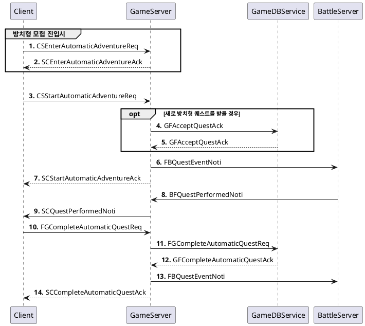

```plantuml
@startuml 메인 퀘스트
actor Client
participant GameServer as "Game Server"
database GameDBService as "GameDBService"
participant BattleServer as "Battle Server"
 
@startuml AutomaticQuest
autonumber "<b> ."
Group 방치형 모험 진입시
Client -> GameServer : CSEnterAutomaticAdventureReq
GameServer --> Client : SCEnterAutomaticAdventureAck
end
loop 방치형 모험 반복
Client -> GameServer : CSStartAutomaticAdventureReq
opt 새로 방치형 퀘스트를 받을 경우
GameServer -> GameDBService : GFAcceptQuestAck
GameDBService --> GameServer : GFAcceptQuestAck
end
GameServer -> BattleServer : FBQuestEventNoti
GameServer --> Client : SCStartAutomaticAdventureAck

BattleServer -> GameServer : BFQuestPerformedNoti
GameServer -> Client : SCQuestPerformedNoti

Client -> GameServer : FGCompleteAutomaticQuestReq
GameServer -> GameDBService : FGCompleteAutomaticQuestReq
GameDBService --> GameServer : GFCompleteAutomaticQuestAck
GameServer -> BattleServer : FBQuestEventNoti
GameServer --> Client : SCCompleteAutomaticQuestAck

```
